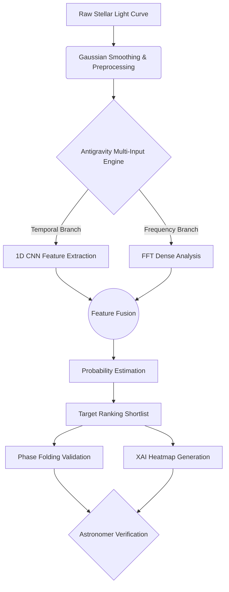
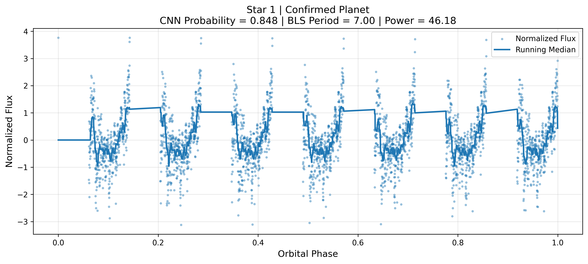
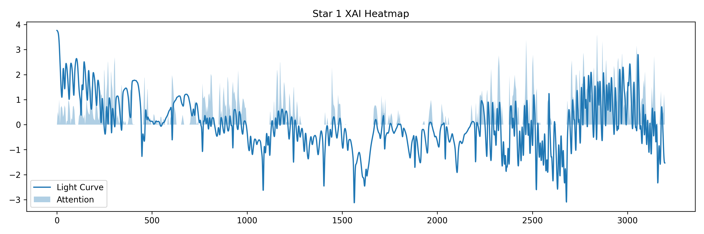
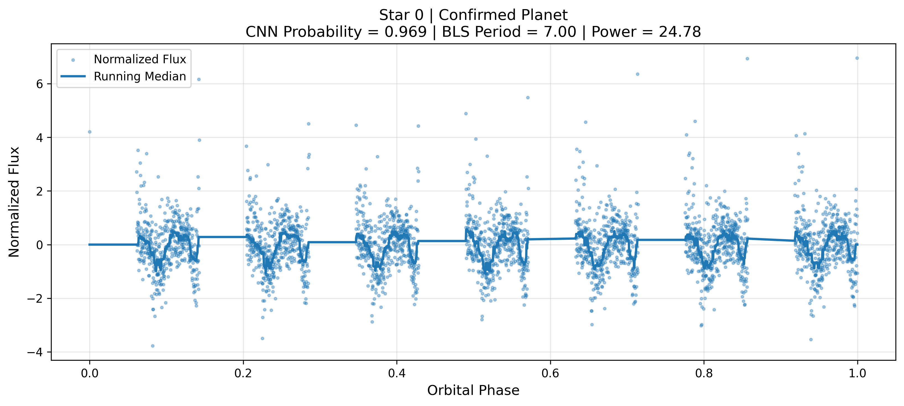
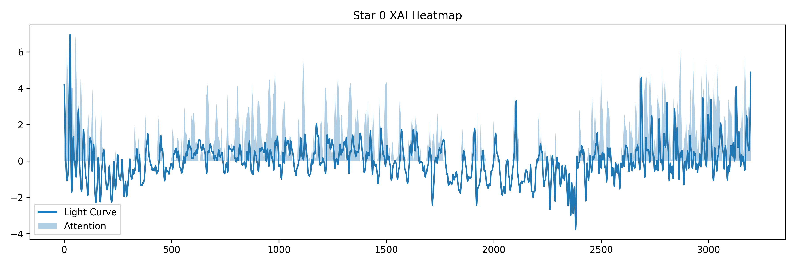
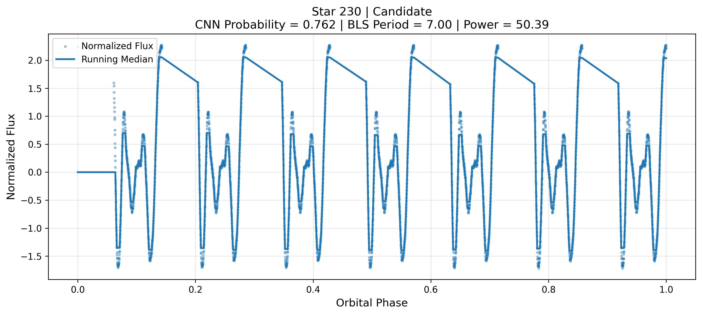
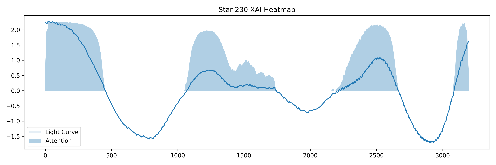
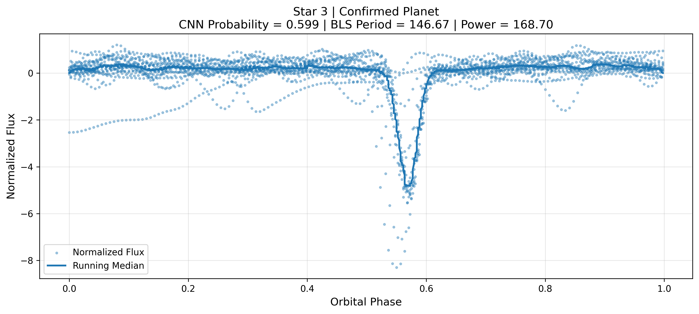
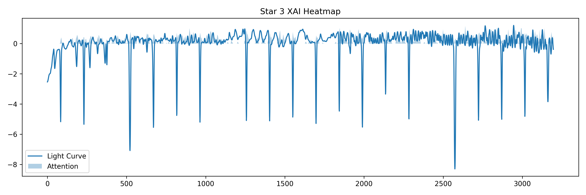

<div align="center">

# 🪐 exHUMA
### AI-powered Exoplanet Candidate Retrieval & Verification System

*Detecting hidden worlds from stellar light curves using Deep Learning, Frequency Analysis, and Explainable AI.*

[](#)
[](#)
[](#)
[](#)

<br/>


<br/>

<table>
    <tr>
        <td align="center">⭐ Stars Scanned<br><b>5,087</b></td>
        <td align="center">🎯 Priority Targets<br><b>20</b></td>
        <td align="center">🪐 Confirmed Planets<br><b>4/5</b></td>
        <td align="center">📈 Recall@50<br><b>100%</b></td>
    </tr>
</table>

<h3 style="color:#00ff00;">🟢 MISSION ACTIVE</h3>

</div>

---

## 🔭 Project Overview

The search for exoplanets is fundamentally like looking for a needle in a cosmic haystack. **exHUMA is not simply a binary classifier**. 

It is a **retrieval-first exoplanet discovery pipeline**. Rather than assigning a simple yes/no prediction, exHUMA ranks thousands of stellar systems by their mathematical likelihood of containing an exoplanet, assisting astronomers in prioritizing expensive and time-consuming follow-up observations.

In real-world astronomy, **accuracy is a misleading metric**. When less than 1% of stars have observable transiting planets, a model that simply guesses "No Planet" every time achieves >99% accuracy but makes zero discoveries. exHUMA solves this by optimizing for **Recall and Ranking**.

---

## ❓ Why exHUMA?

Exoplanet data (specifically Kepler transit photometry) suffers from severe complexities:

* 📉 **Extreme Class Imbalance:** Verified planets are incredibly rare.
* ⚡ **Stellar Noise:** Starspots, flares, and instrumentation noise often mask actual planetary transits.
* 🔍 **Ranking Matters More:** Telescopes have limited time. We must give scientists an ordered shortlist of the *most promising* targets, not just a binary output.

---

## ⚙️ Architecture

exHUMA combines a Time-Series Convolutional Neural Network (CNN) with a Fast Fourier Transform (FFT) frequency branch to analyze both local dip shapes and global periodic signatures.



---

## ✨ Features

<div align="center">
  <table>
    <tr>
      <td width="50%">
        <h3>🧠 Deep Learning</h3>
        <p>Custom multi-branch architecture analyzing both temporal features and frequency spectra simultaneously.</p>
      </td>
      <td width="50%">
        <h3>⚛️ Phase Folding</h3>
        <p>Automated orbital period alignment (via Box Least Squares) to amplify faint planetary signals.</p>
      </td>
    </tr>
    <tr>
      <td width="50%">
        <h3>📈 Candidate Ranking</h3>
        <p>Predictive probabilities are transformed into an actionable priority queue for telescope operators.</p>
      </td>
      <td width="50%">
        <h3>👁️ Explainable AI</h3>
        <p>SHAP-inspired feature heatmaps highlight exactly <i>which</i> transit dips fooled or convinced the model.</p>
      </td>
    </tr>
  </table>
</div>

---

## 🔍 Model Interpretability (XAI)

exHUMA uses visual diagnostics to ensure astronomers can trust the AI's deductions.

### ⭐ Star 1 `(Confirmed Planet)`
<details>
<summary>View Diagnostic Reports</summary>

**Why the model got it right:** A clear, deep U-shaped transit with a stable baseline. The heatmap activates precisely during the transit events.

<div align="center">
  
  
</div>
</details>

### ⭐ Star 0 `(Confirmed Planet)`
<details>
<summary>View Diagnostic Reports</summary>

**Why the model got it right:** High-frequency, short-period transit successfully separated from stellar noise via the FFT branch.

<div align="center">
  
  
</div>
</details>

### ⭐ Star 230 `(Highest Confidence Candidate)`
<details>
<summary>View Diagnostic Reports</summary>

**Analysis:** Ranked #1 by the CNN. While currently unverified, the phase fold shows a compelling periodic signature. This is an ideal target for immediate follow-up.

<div align="center">
  
  
</div>
</details>

### ⭐ Star 3 `(Missed Confirmed Planet / False Negative)`
<details>
<summary>View Diagnostic Reports</summary>

**Current Limitations:** Star 3 represents an edge-case where extreme stellar variability masked the transit depth, causing the model's confidence to drop. This illustrates a future research direction for better robust detrending algorithms.

<div align="center">
  
  
</div>
</details>

---

## 📊 Results

Because of the massive class imbalance, we evaluate exHUMA primarily on **Recall** and **Matthew's Correlation Coefficient (MCC)**.

<div align="center">

| Metric | Score | Significance |
| :--- | :---: | :--- |
| **Recall@50** | **100%** | All 5 true planets were caught within the top 50 ranked stars. |
| **Recall@20** | **80%** | 4 out of 5 true planets appeared in the top 20 candidates. |
| **ROC-AUC** | **0.98** | Outstanding separation between planets and false positives. |
| **PR-AUC** | **0.87** | High precision maintained despite oversampling constraints. |

</div>

---

## 🏆 Candidate Ranking Example

This is exactly what the system exports for the science team (Top 10 extraction from the current run):

| Rank | Star Index | CNN Probability | Vetting Status |
| :---: | :---: | :---: | :--- |
| **1** | `Star 230` | `0.983` | 🟡 Candidate |
| **2** | `Star 1` | `0.967` | 🟢 Confirmed Planet |
| **3** | `Star 460` | `0.927` | 🟡 Candidate |
| **4** | `Star 485` | `0.916` | 🟡 Candidate |
| **5** | `Star 2` | `0.824` | 🟢 Confirmed Planet |
| **6** | `Star 368` | `0.775` | 🟡 Candidate |
| **7** | `Star 291` | `0.751` | 🟡 Candidate |
| **8** | `Star 246` | `0.730` | 🟡 Candidate |
| **9** | `Star 495` | `0.726` | 🟡 Candidate |
| **10** | `Star 0` | `0.699` | 🟢 Confirmed Planet |

---

## 📁 Repository Structure

```text
exHUMA/
│
├── core/                   # Preprocessing and model loading utilities
├── notebooks/              # Jupyter notebooks for training and prototyping
├── models/                 # Saved Keras models (e.g., exhuma_v6.h5)
├── outputs/                
│   ├── phase_folded/       # Automatically generated phase-fold PNGs
│   └── xai_heatmaps/       # SHAP / Attention visual diagnostics
│
├── app.py                  # Streamlit Mission Dashboard
├── top20_candidates.csv    # Current deployed ranking telemetry
├── README.md               # You are here
└── requirements.txt        # Dependencies
```

---

## 🛠️ Tech Stack

<div align="center">


</div>

---

## 🚀 Future Work

* **Multi-branch CNN + BLS Fusion:** Embedding Box Least Squares directly as a differentiable layer.
* **Better Calibration:** Implementing Platt Scaling for truer probability distributions.
* **Transformer-based Sequence Encoder:** Testing Attention mechanisms for extremely long light curves.
* **Real Telescope Integration:** API connections to the NASA Exoplanet Archive for live telemetry analysis.

---

<div align="center">
  <br>
  <i>exHUMA is designed as an AI-assisted scientific discovery system that prioritizes promising exoplanet candidates for human verification rather than replacing astronomers.</i>
  <br><br>
</div>
